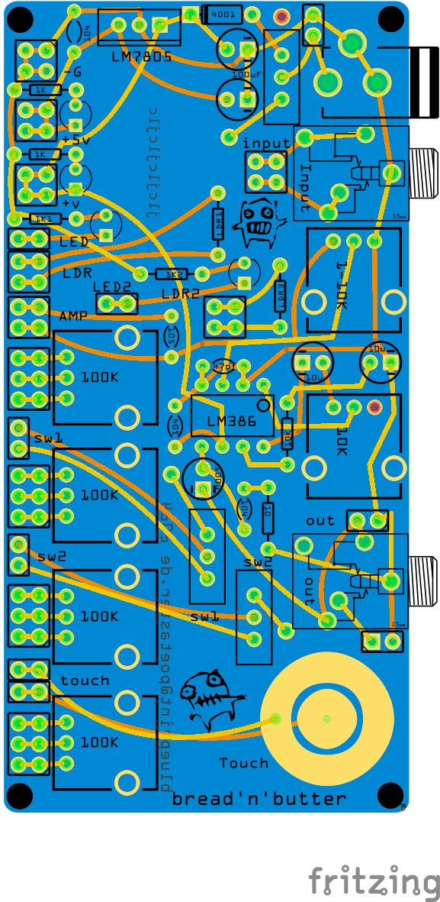
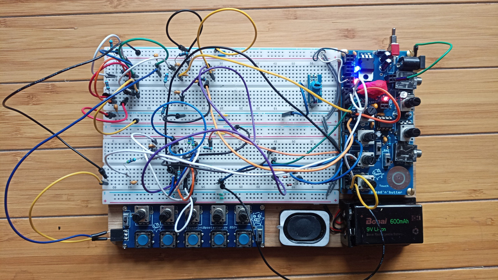

# breadnbutter
Bread n Butter is an audio prototyping system consisting of 2 pcbs with  buttons knobs &amp; 
amplifier section, headphone out, 3.5mm in  + breadboard.

These are the design files (in fritzing) and gerbers. I initially made these since I use the old omsynth but only have one :)

You can buy these from me if you don't want to build it :) I sell on https://tonetoys.etsy.com and Tindie, or you can do so directly. See instructions on https://poetaster.org

The gerbers here are 'unfilled', though I'm producing filled ones. It's easier to modify/add things to the board with unfilled ones, so I've left it unfilled to permit you to create boards that you can hack stuff into if you don't use cad software.
